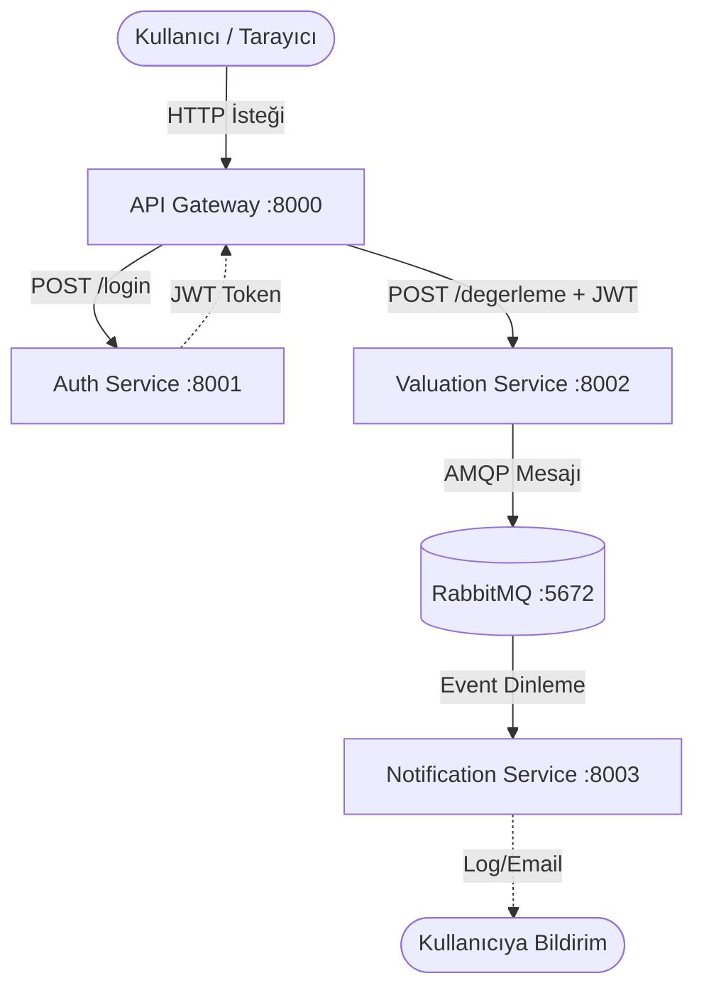

# Araç Değerleme Sistemi - Mikroservis Mimarisi (HW2)

## Grup Üyeleri
| İsim | Numara |
|---|---|
| Kayra Çolak | B2180.060068 |
| Mustafa Yalçın Canbay | B2180.060055 |
| Gökberk Dökmen | B2180.060041 |
| Umut Sınır | B2180.060013 |

Bu proje, araç değerleme işlemini gerçekleştiren dağıtık bir mikroservis sistemidir. Servisler birbirleriyle hem **senkron (REST)** hem de **asenkron (RabbitMQ)** yöntemlerle iletişim kurar.

## Sistem Mimarisi

```
Kullanıcı
    │
    ▼
[API Gateway :8080]  ←── Tek giriş noktası, JWT doğrulama
    │           │
    │           │  REST (HTTP)
    ▼           ▼
[Auth Service] [Valuation Service]
  :8001            :8000
                      │
                      │  Asenkron (RabbitMQ)
                      ▼
              [Notification Service]
                (Kuyruk Dinleyici)
```

## Servisler

| Servis | Port | Görev |
|---|---|---|
| API Gateway | 8080 | Tek giriş noktası, JWT doğrulama, yönlendirme |
| Auth Service | 8001 | Kullanıcı kaydı ve JWT token üretimi |
| Valuation Service | 8000 | Araç fiyat hesaplama |
| Notification Service | - | RabbitMQ kuyruk dinleyici, bildirim simülasyonu |
| RabbitMQ | 5672/15672 | Asenkron mesaj kuyruğu |

## İletişim Türleri

### 1. Senkron İletişim (REST/HTTP)
Kullanıcı → API Gateway → Auth/Valuation Service zinciri **HTTP** üzerinden gerçekleşir. API Gateway, gelen her `/api/v1/degerleme` isteğinde önce JWT token'ı doğrular, sonra isteği Valuation Service'e iletir.

### 2. Asenkron İletişim (Message Queue)
Değerleme tamamlandığında Valuation Service, RabbitMQ'daki `valuation_events` kuyruğuna bir mesaj bırakır. Notification Service bu kuyruğu dinler ve mesaj geldiğinde kullanıcıya bildirim gönderildiğini loglar.

## Kullanılan Teknolojiler
- **FastAPI & Python:** REST API tasarımı
- **JWT (JSON Web Token):** Kimlik doğrulama ve yetkilendirme
- **RabbitMQ & pika:** Asenkron olay tabanlı mesajlaşma
- **Docker & Docker Compose:** Konteynerizasyon ve orkestrasyon
- **Clean Architecture:** Her servis kendi sorumluluğuna odaklanır

## Kurulum ve Çalıştırma

```bash
# Tüm sistemi tek komutla ayağa kaldır
docker-compose up --build

# Arka planda çalıştırmak için
docker-compose up --build -d
```

## API Kullanımı

### Adım 1: Kayıt Ol
```bash
curl -X POST http://localhost:8080/register \
  -H "Content-Type: application/json" \
  -d '{"username": "kullanici1", "password": "sifre123"}'
```

### Adım 2: Giriş Yap (Token Al)
```bash
curl -X POST http://localhost:8080/login \
  -H "Content-Type: application/json" \
  -d '{"username": "kullanici1", "password": "sifre123"}'
```

### Adım 3: Araç Değerle (Token ile)
```bash
curl -X POST http://localhost:8080/api/v1/degerleme \
  -H "Content-Type: application/json" \
  -H "Authorization: Bearer <BURAYA_TOKEN>" \
  -d '{"marka": "Toyota", "model_yili": 2020, "kilometre": 50000, "hasar_kaydi": false}'
```

### RabbitMQ Yönetim Paneli
Tarayıcıdan `http://localhost:15672` adresine git. Kullanıcı adı: `guest`, Şifre: `guest`

## Sistem Mimarisi (Architecture Diagram)


