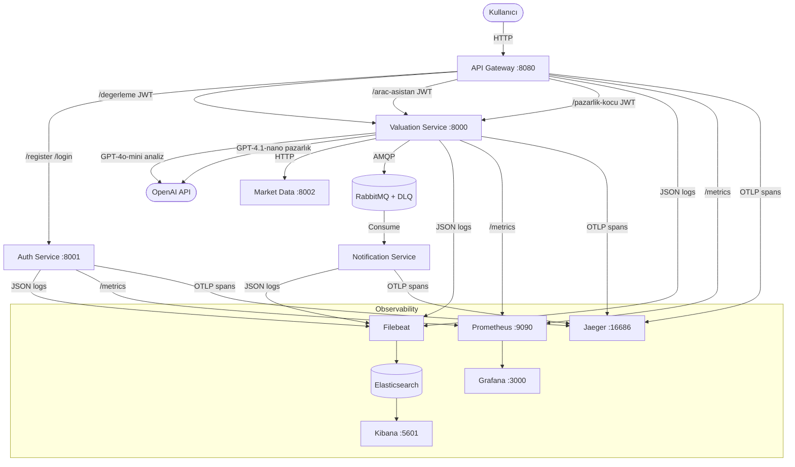

# Araç Değerleme Sistemi — Mikroservis Mimarisi

## Ekip

| İsim | Öğrenci No |
|---|---|
| Kayra Çolak | B2180.060068 |
| Mustafa Yalçın Canbay | B2180.060055 |
| Gökberk Dökmen | B2180.060041 |
| Umut Sınır | B2180.060013 |

---

## Projeye Genel Bakış

Mikroservis mimarisiyle geliştirilmiş bir araç değerleme sistemi. Kullanıcılar kayıt olup giriş yaparak JWT korumalı endpoint üzerinden yapay zeka destekli fiyat tahmini, piyasa analizi ve pazarlık argümanı üretme özelliklerinden yararlanabilir.

**Bu ödevde eklenen katmanlar:**
- Güvenlik: bcrypt şifre hashleme, rate limiting, güvenli secret yönetimi
- Gözlemlenebilirlik: ELK, Prometheus + Grafana, OpenTelemetry + Jaeger, health check
- Hata toleransı: circuit breaker, retry/backoff, dead letter queue
- Piyasa zekası: Market Data Service (sahibinden.com / arabam.com ilhamlı)
- Gelişmiş AI: fiyat analizi, 6 aylık öngörü, AI chatbot, Pazarlık Koçu

---

## Mimari

### Uygulama Akışı

```
┌─────────────────────────────────────────────────────────────────┐
│                         KULLANICI / TARAYICI                    │
└───────────────────────────────┬─────────────────────────────────┘
                                │ HTTP
                                ▼
                ┌───────────────────────────────┐
                │    API GATEWAY  :8080          │
                │  · JWT doğrulama               │
                │  · Rate limiting (slowapi)     │
                │  · İstek yönlendirme           │
                │  · X-Trace-ID üretimi          │
                └──────────┬────────────┬────────┘
                           │            │
              REST/HTTP     │            │  REST/HTTP
                           ▼            ▼
              ┌────────────────┐  ┌──────────────────────────┐
              │  AUTH SERVICE  │  │   VALUATION SERVICE      │
              │    :8001       │  │        :8000             │
              │  · Kayıt/Giriş │  │  · Fiyat + DNA analizi   │
              │  · bcrypt hash │  │  · GPT-4o-mini analizi   │
              │  · JWT üretimi │  │  · Pazarlık Koçu (nano)  │
              └────────────────┘  │  · AI chatbot            │
                                  │  · RabbitMQ yayını       │
                                  └──────────┬───────────────┘
                                             │ HTTP
                                             ▼
                              ┌──────────────────────────┐
                              │  MARKET DATA SERVICE     │
                              │        :8002             │
                              │  · Benzer ilanlar        │
                              │  · Şehir bazlı fiyat     │
                              │  · Talep skoru           │
                              └──────────────────────────┘
                                             │ AMQP
                                             ▼
                              ┌──────────────────────────┐
                              │  RABBITMQ + DLQ          │
                              │  Notification Service    │
                              └──────────────────────────┘
```

### Gözlemlenebilirlik Katmanı

```
Tüm Servisler (stdout JSON log) ──► Filebeat ──► Elasticsearch ──► Kibana :5601
Tüm Servisler (/metrics)         ──► Prometheus :9090 ──► Grafana :3000
Tüm Servisler (OTLP HTTP spans)  ──► Jaeger :4318 ──► Jaeger UI :16686
```

### Mermaid Diyagram


```mermaid
graph TD
    Client([Kullanıcı]) -->|HTTP| GW[API Gateway :8080]

    GW -->|/register /login| Auth[Auth Service :8001]
    GW -->|/degerleme JWT| Val[Valuation Service :8000]
    GW -->|/arac-asistan JWT| Val
    GW -->|/pazarlik-kocu JWT| Val

    Val -->|GPT-4o-mini analiz| OAI([OpenAI API])
    Val -->|GPT-4.1-nano pazarlık| OAI
    Val -->|HTTP| MDS[Market Data :8002]
    Val -->|AMQP| MQ[(RabbitMQ + DLQ)]
    MQ -->|Consume| Notif[Notification Service]

    subgraph Observability
        Filebeat --> ES[(Elasticsearch)]
        ES --> Kibana[Kibana :5601]
        Prom[Prometheus :9090] --> Grafana[Grafana :3000]
        Jaeger[Jaeger :16686]
    end

    GW & Auth & Val & Notif -->|JSON logs| Filebeat
    GW & Auth & Val -->|/metrics| Prom
    GW & Auth & Val & Notif -->|OTLP spans| Jaeger
```

---

## Servisler

| Servis | Port | Görev |
|---|---|---|
| API Gateway | 8080 | Tek giriş noktası, JWT doğrulama, rate limiting, yönlendirme |
| Auth Service | 8001 | Kullanıcı kaydı (bcrypt), giriş, JWT üretimi |
| Valuation Service | 8000 | Fiyat hesaplama + AI analizi + Pazarlık Koçu + chatbot |
| Notification Service | — | RabbitMQ tüketici, bildirim simülasyonu |
| Market Data Service | 8002 | Piyasa zekası — benzer ilanlar, şehir bazlı fiyat, talep skoru |
| RabbitMQ | 5672 / 15672 | Asenkron mesaj kuyruğu |
| Elasticsearch | 9200 | Log depolama |
| Kibana | 5601 | Log görselleştirme |
| Prometheus | 9090 | Metrik toplama |
| Grafana | 3000 | Metrik dashboard |
| Jaeger | 16686 | Distributed tracing UI |

---

## Teknoloji Yığını

| Kategori | Teknoloji |
|---|---|
| API Framework | FastAPI + Python 3.11 |
| Kimlik Doğrulama | JWT (HS256, 30 dk) + bcrypt şifre hashleme |
| Rate Limiting | slowapi (per-IP, 10–30 istek/dk) |
| Secret Yönetimi | Ortam değişkenleri (.env) |
| Asenkron Mesajlaşma | RabbitMQ + pika |
| AI Entegrasyonu | OpenAI GPT-4o-mini (analiz) + GPT-4.1-nano (pazarlık) |
| Konteynerizasyon | Docker + Docker Compose |
| Orkestrasyon | Kubernetes |
| CI/CD | GitHub Actions |
| Test | pytest (21 test) |
| Piyasa Zekası | Market Data Service (sahibinden/arabam ilhamlı) |
| Merkezi Loglama | ELK Stack + Filebeat |
| Structured Logging | python-json-logger |
| Metrik İzleme | Prometheus + Grafana |
| Dağıtık İzleme | OpenTelemetry + Jaeger |
| Circuit Breaker | pybreaker |
| Retry / Backoff | tenacity |

---

## Hızlı Başlangıç

### 1. Gereksinimler

- [Docker Desktop](https://www.docker.com/products/docker-desktop/) kurulu ve çalışıyor
- OpenAI API key

### 2. Ortam Değişkenlerini Ayarla

```bash
cp .env.example .env
# .env dosyasını düzenle
```

`.env` içeriği:
```
OPENAI_API_KEY=sk-proj-...
JWT_SECRET_KEY=en-az-32-karakterlik-guclu-anahtar
```

> `.env.example` git'e giden şablondur — gerçek değerleri `.env`'e yaz, bu dosya `.gitignore`'dadır.

### 3. Başlat

**Hafif (sadece uygulama, ~400 MB RAM):**
```bash
docker-compose up -d auth-service valuation-service market-data-service api-gateway rabbitmq
```

**Tam stack, monitoring dahil (~1.5 GB RAM):**
```bash
docker-compose up -d
```

> İlk çalıştırmada Elasticsearch + Kibana image'ları ~2 GB indirilir, 10-15 dakika sürebilir.

```bash
docker-compose down        # durdur
docker-compose down -v     # durdur + verileri sıfırla
docker-compose up -d --build   # kod değişikliği sonrası yeniden build
```

---

## Tüm Erişim Noktaları

| URL | Açıklama | Giriş |
|---|---|---|
| http://localhost:8000 | Araç değerleme arayüzü | — |
| http://localhost:8001 | Giriş / Kayıt sayfası | — |
| http://localhost:8080 | API Gateway | — |
| http://localhost:15672 | RabbitMQ paneli | `guest` / `guest` |
| http://localhost:3000 | Grafana dashboard | `admin` / `admin` |
| http://localhost:16686 | Jaeger tracing | — |
| http://localhost:9090 | Prometheus | — |
| http://localhost:5601 | Kibana logları | — |

### Health Check

```bash
curl http://localhost:8080/health   # Gateway + bağımlılıklar
curl http://localhost:8000/health   # Valuation + RabbitMQ + circuit breaker
curl http://localhost:8001/health   # Auth
```

---

## Güvenlik

### bcrypt Şifre Hashleme

Şifreler veritabanında **asla düz metin** saklanmaz. Her şifre için rastgele salt üretilir:

```
Kayıt: "pass123" → bcrypt(salt) → "$2b$12$abc...xyz"
Giriş: bcrypt.checkpw("pass123", stored_hash) → True/False
```

### Rate Limiting

Her endpoint IP başına dakika bazında sınırlıdır:

| Endpoint | Limit |
|---|---|
| `POST /register` | 10 istek/dk |
| `POST /login` | 20 istek/dk |
| `POST /api/v1/degerleme` | 30 istek/dk |
| `POST /api/v1/arac-asistan` | 10 istek/dk |

Sınır aşılınca `429 Too Many Requests` döner.

### Secure Secret Yönetimi

`JWT_SECRET_KEY` ortam değişkeninden okunur. Kısa key ile başlatılırsa servis uyarı loglar:
```
WARNING: JWT_SECRET_KEY 32 karakterden kısa — production için güvenli bir key kullanın!
```

---

## API Kullanımı

### Adım 1 — Kayıt Ol

```bash
curl -X POST http://localhost:8080/register \
  -H "Content-Type: application/json" \
  -d '{"username": "testuser", "password": "pass123"}'
# HTTP 201
```

### Adım 2 — Giriş Yap

```bash
curl -X POST http://localhost:8080/login \
  -H "Content-Type: application/json" \
  -d '{"username": "testuser", "password": "pass123"}'
# Yanıt: {"access_token": "eyJ...", "token_type": "bearer"}
```

### Adım 3 — Araç Değerle

```bash
curl -X POST http://localhost:8080/api/v1/degerleme \
  -H "Content-Type: application/json" \
  -H "Authorization: Bearer <TOKEN>" \
  -d '{"marka": "Toyota", "model_yili": 2020, "kilometre": 50000, "hasar_kaydi": false, "il": "istanbul"}'
```

**Örnek yanıt:**
```json
{
  "hesaplanan_fiyat_tl": 551745,
  "faktorler": {
    "taban_fiyat": 800000,
    "yas_etkisi": -150000,
    "kilometre_etkisi": -90000,
    "hasar_etkisi": 0,
    "piyasa_dalgalanmasi": -8255
  },
  "ai_analizi": {
    "piyasa_yorumu": "Fiyat piyasa koşullarına göre rekabetçi.",
    "ozet": "Düşük kilometre güçlü yön.",
    "ongoru": "6 ay içinde fiyat stabil kalması bekleniyor.",
    "alici_profili": "Güvenilir araç arayan aileler için ideal.",
    "satis_taktigi": "İlkbahar sezonunda İstanbul'da listeleyin."
  },
  "piyasa_raporu": { ... }
}
```

### Adım 4 — Pazarlık Koçu (AI)

Satıcının istediği fiyat karşısında AI'dan somut pazarlık argümanları al:

```bash
curl -X POST http://localhost:8000/api/v1/pazarlik-kocu \
  -H "Content-Type: application/json" \
  -d '{
    "marka": "Toyota", "model_yili": 2020, "kilometre": 75000,
    "hasar_kaydi": false, "il": "istanbul",
    "satis_fiyati": 620000, "hesaplanan_fiyat": 551745
  }'
```

**Yanıt:** 4 pazarlık argümanı + hedef fiyat + alt sınır (gpt-4.1-nano ile üretilir)

### Adım 5 — AI Araç Asistanı

```bash
curl -X POST http://localhost:8080/api/v1/arac-asistan \
  -H "Content-Type: application/json" \
  -H "Authorization: Bearer <TOKEN>" \
  -d '{"soru": "Bu aracı şimdi almalı mıyım?", "gecmis": []}'
```

---

## Kullanıcı Arayüzü

Değerleme arayüzü 4 sekmeli tasarıma sahiptir:

| Sekme | İçerik |
|---|---|
| **Özet** | Animasyonlu fiyat sayacı, piyasa pozisyon çubuğu, SVG talep göstergesi, Fiyat DNA analizi |
| **Piyasa** | Benzer ilanlar, şehir bazlı fiyat karşılaştırması, değer tahmini, uyarılar |
| **AI Koç** | 6 aylık öngörü, ideal alıcı profili, satış taktiği + Pazarlık Koçu aracı |
| **Asistan** | Araç bağlamını bilen AI chatbot |

---

## Fiyat Hesaplama Algoritması

```
Taban fiyat:          800.000 TL
- Yaş cezası:         (güncel_yıl - model_yılı) × 25.000 TL
- Kilometre cezası:   kilometre × 1,2 TL
- Hasar indirimi:     × 0,80  (hasar kaydı varsa %20 indirim)
- Rastgele varyans:   ±15.000 TL
- Minimum tavan:      50.000 TL
```

Yanıtta `faktorler` alanı her faktörün katkısını ayrı ayrı gösterir (UI'da DNA grafiği olarak görselleştirilir).

---

## Gözlemlenebilirlik

### Merkezi Loglama — ELK Stack

Her log satırında `service`, `level`, `trace_id`, `message` alanları bulunur. Kibana'da:
1. http://localhost:5601 → **Discover** → `microservices-*` data view oluştur
2. Örnek filtre: `trace_id: "abc123"` → tek isteğin tüm servislerdeki izini gör

### Metrik İzleme — Prometheus + Grafana

| Metrik | Açıklama |
|---|---|
| `http_requests_total` | Toplam istek sayısı |
| `http_request_duration_seconds` | p50 / p95 / p99 latency |
| `valuation_price_tl` | Hesaplanan fiyat dağılımı |
| `openai_api_calls_total` | OpenAI çağrıları (success/failure/circuit_open) |
| `circuit_breaker_state` | 0=kapalı, 1=açık, 2=yarı-açık |

Grafana: http://localhost:3000 → `admin/admin` → **Araba Değerleme — Mikroservis Dashboard**

### Dağıtık İzleme — Jaeger

Jaeger: http://localhost:16686 → Service: `api-gateway` → Find Traces

### Hata Toleransı

**Circuit Breaker (OpenAI):** 3 ardışık hata → devre açılır → 30 sn fallback döner → otomatik kapanır

**Retry (RabbitMQ publish):** 3 deneme, 1s→2s→4s backoff

**Dead Letter Queue:** İşlenemeyen mesajlar `valuation_events_dlq`'ya taşınır

---

## Otomatik Testler

```bash
pip install -r requirements-test.txt
pytest tests/ -v
```

```
tests/
├── test_auth_service.py       # Kayıt, giriş, bcrypt hashleme (7 test)
├── test_valuation_service.py  # Fiyat algoritması, hasar indirimi, AI fallback (7 test)
└── test_api_gateway.py        # JWT doğrulama, rate limit, proxy, status code (7 test)
```

---

## Proje Yapısı

```
araba-degerleme-odevi/
├── api-gateway/               # JWT + rate limiting + yönlendirme
├── auth-service/              # bcrypt + JWT üretimi
├── valuation-service/         # Fiyat motoru + AI + Pazarlık Koçu + chatbot
│   ├── main.py
│   ├── models.py              AracOzellikleri, PazarlikIstegi
│   └── services.py            fiyat_hesapla + fiyat_hesapla_detay
├── notification-service/      # RabbitMQ consumer
├── market-data-service/       # Piyasa zekası motoru
│   ├── main.py
│   └── market_engine.py       Benzer ilanlar, şehir çarpanı, talep skoru, anomali
├── monitoring/
│   ├── prometheus/
│   ├── grafana/               Otomatik datasource + 9 panelli dashboard
│   ├── filebeat/
│   └── rabbitmq/
├── tests/                     21 otomatik test
├── k8s/                       Kubernetes manifest'leri
├── .github/workflows/         GitHub Actions CI/CD
├── docker-compose.yml
└── .env.example
```

---

## Kubernetes ile Çalıştırma

```bash
eval $(minikube docker-env)
docker compose build
# k8s/secret.yaml içinde OPENAI_API_KEY ve JWT_SECRET_KEY ayarla
bash deploy.sh
kubectl port-forward svc/api-gateway 8080:8080 -n araba-degerleme
```

> Monitoring stack Docker Compose ortamına özeldir, Kubernetes manifest'leri yalnızca uygulama servislerini içerir.
