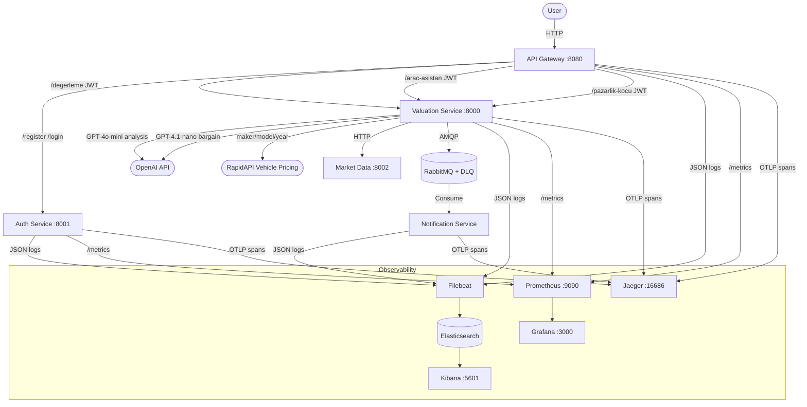

# Car Valuation System — Microservice Architecture

## Team

| Name | Student ID |
|---|---|
| Kayra Çolak | B2180.060068 |
| Mustafa Yalçın Canbay | B2180.060055 |
| Gökberk Dökmen | B2180.060041 |
| Umut Sınır | B2180.060013 |

---

## About the Project

This is a car valuation system. It uses microservice architecture. Users can register and log in. After login, they can get an AI price estimate, see market analysis, and get bargaining tips. The system uses JWT tokens to protect the endpoints.

**New features added in this homework:**
- Security: bcrypt password hashing, rate limiting, safe secret management
- Observability: ELK, Prometheus + Grafana, OpenTelemetry + Jaeger, health check
- Fault tolerance: circuit breaker, retry/backoff, dead letter queue
- Market intelligence: Market Data Service (inspired by sahibinden.com / arabam.com)
- Real price data: RapidAPI Vehicle Pricing + 2026 Turkey brand price table
- Turkey tax calculation: SCT (by engine cc), VAT, motor tax, insurance, transfer costs
- Advanced AI: price analysis, 6-month forecast, AI chatbot, Bargaining Coach
- Detailed UI: 4-section form (identity, technical, condition, location) + 5-tab result

---

## Architecture

### Application Flow

```
┌─────────────────────────────────────────────────────────────────┐
│                         USER / BROWSER                          │
└───────────────────────────────┬─────────────────────────────────┘
                                │ HTTP
                                ▼
                ┌───────────────────────────────┐
                │    API GATEWAY  :8080          │
                │  · JWT validation              │
                │  · Rate limiting (slowapi)     │
                │  · Request routing             │
                │  · X-Trace-ID generation       │
                └──────────┬────────────┬────────┘
                           │            │
              REST/HTTP     │            │  REST/HTTP
                           ▼            ▼
              ┌────────────────┐  ┌──────────────────────────┐
              │  AUTH SERVICE  │  │   VALUATION SERVICE      │
              │    :8001       │  │        :8000             │
              │  · Register    │  │  · RapidAPI price fetch  │
              │  · bcrypt hash │  │  · Brand-based fallback  │
              │  · JWT token   │  │  · GPT-4o-mini analysis  │
              └────────────────┘  │  · Bargaining Coach      │
                                  │  · AI chatbot            │
                                  │  · RabbitMQ publish      │
                                  └──────────┬───────────────┘
                                             │
                       ┌─────────────────────┼─────────────────────┐
                       │ HTTP                │ HTTPS               │ HTTP
                       ▼                     ▼                     ▼
              ┌────────────────┐   ┌──────────────────┐   ┌────────────────┐
              │ MARKET DATA    │   │  RapidAPI        │   │  OpenAI API    │
              │    :8002       │   │  Vehicle Pricing │   │  GPT-4o-mini   │
              │ · Similar ads  │   │  (real price)    │   │  GPT-4.1-nano  │
              │ · City factor  │   └──────────────────┘   └────────────────┘
              │ · Demand score │
              └────────────────┘
                                             │ AMQP
                                             ▼
                              ┌──────────────────────────┐
                              │  RABBITMQ + DLQ          │
                              │  Notification Service    │
                              └──────────────────────────┘
```

### Observability Layer

```
All Services (stdout JSON log) ──► Filebeat ──► Elasticsearch ──► Kibana :5601
All Services (/metrics)        ──► Prometheus :9090 ──► Grafana :3000
All Services (OTLP HTTP spans) ──► Jaeger :4318 ──► Jaeger UI :16686
```

### Mermaid Diagram


```mermaid
graph TD
    Client([User]) -->|HTTP| GW[API Gateway :8080]

    GW -->|/register /login| Auth[Auth Service :8001]
    GW -->|/degerleme JWT| Val[Valuation Service :8000]
    GW -->|/arac-asistan JWT| Val
    GW -->|/pazarlik-kocu JWT| Val

    Val -->|GPT-4o-mini analysis| OAI([OpenAI API])
    Val -->|GPT-4.1-nano bargain| OAI
    Val -->|maker/model/year| RAPI([RapidAPI Vehicle Pricing])
    Val -->|HTTP| MDS[Market Data :8002]
    Val -->|AMQP| MQ[(RabbitMQ + DLQ)]
    MQ -->|Consume| Notif[Notification Service]

    subgraph Observability
        Filebeat --> ES[(Elasticsearch)]
        ES --> Kibana[Kibana :5601]
        Prom[Prometheus :9090] --> Grafana[Grafana :3000]
        Jaeger[Jaeger :16686]
    end

    GW & Auth & Val & Notif -->|JSON logs| Filebeat
    GW & Auth & Val -->|/metrics| Prom
    GW & Auth & Val & Notif -->|OTLP spans| Jaeger
```

---

## Services

| Service | Port | Job |
|---|---|---|
| API Gateway | 8080 | Single entry point, JWT validation, rate limiting, routing |
| Auth Service | 8001 | User registration (bcrypt), login, JWT generation |
| Valuation Service | 8000 | Price calculation + AI analysis + Bargaining Coach + chatbot |
| Notification Service | — | RabbitMQ consumer, notification simulation |
| Market Data Service | 8002 | Market intelligence — similar listings, city-based price, demand score |
| RabbitMQ | 5672 / 15672 | Async message queue |
| Elasticsearch | 9200 | Log storage |
| Kibana | 5601 | Log visualization |
| Prometheus | 9090 | Metric collection |
| Grafana | 3000 | Metric dashboard |
| Jaeger | 16686 | Distributed tracing UI |

---

## Technology Stack

| Category | Technology |
|---|---|
| API Framework | FastAPI + Python 3.11 |
| Authentication | JWT (HS256, 30 min) + bcrypt password hashing |
| Rate Limiting | slowapi (per-IP, 10–30 requests/min) |
| Secret Management | Environment variables (.env) |
| Async Messaging | RabbitMQ + pika |
| AI Integration | OpenAI GPT-4o-mini (analysis) + GPT-4.1-nano (bargaining) |
| Real Price Data | RapidAPI Vehicle Pricing API (via httpx) |
| Tax Model | Turkey SCT (by engine cc/fuel, tiered) + VAT + Motor Tax |
| Containerization | Docker + Docker Compose |
| Orchestration | Kubernetes |
| CI/CD | GitHub Actions |
| Testing | pytest (21 tests) |
| Market Intelligence | Market Data Service (sahibinden/arabam inspired) |
| Central Logging | ELK Stack + Filebeat |
| Structured Logging | python-json-logger |
| Metric Monitoring | Prometheus + Grafana |
| Distributed Tracing | OpenTelemetry + Jaeger |
| Circuit Breaker | pybreaker |
| Retry / Backoff | tenacity |

---

## Quick Start

### 1. Requirements

- [Docker Desktop](https://www.docker.com/products/docker-desktop/) installed and running
- OpenAI API key

### 2. Set Environment Variables

```bash
cp .env.example .env
# edit the .env file
```

`.env` contents:
```
OPENAI_API_KEY=sk-proj-...              # required for AI analysis + chatbot + bargaining coach
JWT_SECRET_KEY=at-least-32-chars-strong-key
RAPIDAPI_KEY=...                        # Vehicle Pricing API (real price data); fallback is used if missing
USD_TO_TRL=35                           # optional, default is 35
```

> `.env.example` is the template file that goes to git — write real values to `.env`, this file is in `.gitignore`.
> If `RAPIDAPI_KEY` is missing, the system uses a brand-based 2026 Turkey price table + compound depreciation.

### 3. Start

**Light mode (only app services, ~400 MB RAM):**
```bash
docker-compose up -d auth-service valuation-service market-data-service api-gateway rabbitmq
```

**Full stack with monitoring (~1.5 GB RAM):**
```bash
docker-compose up -d
```

> On the first run, Elasticsearch + Kibana images are about 2 GB. Download can take 10–15 minutes.

```bash
docker-compose down        # stop
docker-compose down -v     # stop + reset data
docker-compose up -d --build   # rebuild after code changes
```

---

## Access Points

| URL | Description | Login |
|---|---|---|
| **http://localhost:8080** | **Single page UI** — register, login, valuation, AI coach, assistant | — |
| http://localhost:8000 | Valuation Service (API) | — |
| http://localhost:8001 | Auth Service (API) | — |
| http://localhost:8002 | Market Data Service (API) | — |
| http://localhost:15672 | RabbitMQ panel | `guest` / `guest` |
| http://localhost:3000 | Grafana dashboard | `admin` / `admin` |
| http://localhost:16686 | Jaeger tracing | — |
| http://localhost:9090 | Prometheus | — |
| http://localhost:5601 | Kibana logs | — |

> All user actions go through port 8080. Other ports only serve API endpoints.

### Health Check

```bash
curl http://localhost:8080/health   # Gateway + dependencies
curl http://localhost:8000/health   # Valuation + RabbitMQ + circuit breaker
curl http://localhost:8001/health   # Auth
```

---

## Security

### bcrypt Password Hashing

Passwords are **never stored as plain text**. A random salt is created for each password:

```
Register: "pass123" → bcrypt(salt) → "$2b$12$abc...xyz"
Login:    bcrypt.checkpw("pass123", stored_hash) → True/False
```

### Rate Limiting

Each endpoint has a per-IP, per-minute limit:

| Endpoint | Limit |
|---|---|
| `POST /register` | 10 requests/min |
| `POST /login` | 20 requests/min |
| `POST /api/v1/degerleme` | 30 requests/min |
| `POST /api/v1/arac-asistan` | 10 requests/min |

When the limit is exceeded, the server returns `429 Too Many Requests`.

### Secure Secret Management

`JWT_SECRET_KEY` is read from the environment variable. If a short key is used, the service logs a warning:
```
WARNING: JWT_SECRET_KEY is shorter than 32 characters — use a secure key for production!
```

---

## API Usage

### Step 1 — Register

```bash
curl -X POST http://localhost:8080/register \
  -H "Content-Type: application/json" \
  -d '{"username": "testuser", "password": "pass123"}'
# HTTP 201
```

### Step 2 — Login

```bash
curl -X POST http://localhost:8080/login \
  -H "Content-Type: application/json" \
  -d '{"username": "testuser", "password": "pass123"}'
# Response: {"access_token": "eyJ...", "token_type": "bearer"}
```

### Step 3 — Value a Car

```bash
curl -X POST http://localhost:8080/api/v1/degerleme \
  -H "Content-Type: application/json" \
  -H "Authorization: Bearer <TOKEN>" \
  -d '{"marka":"Toyota","model":"Corolla","model_yili":2020,"kilometre":50000,"hasar_kaydi":false,"il":"istanbul"}'
```

> The `model` field is optional. If given, real price data is fetched from RapidAPI Vehicle Pricing. If not given, a brand-based 2026 base price + compound depreciation is used.

**Example response:**
```json
{
  "hesaplanan_fiyat_tl": 1245000,
  "faktorler": {
    "taban_fiyat": 1320000,
    "yas_etkisi": 0,
    "kilometre_etkisi": -55000,
    "hasar_etkisi": 0,
    "piyasa_dalgalanmasi": -20000
  },
  "ai_analizi": {
    "piyasa_yorumu": "Price is competitive for market conditions.",
    "ozet": "Low mileage is a strong point.",
    "ongoru": "Price is expected to stay stable in 6 months.",
    "alici_profili": "Ideal for families looking for a reliable car.",
    "satis_taktigi": "List it in Istanbul in spring season."
  },
  "piyasa_raporu": { ... }
}
```

### Step 4 — Bargaining Coach (AI)

Get real bargaining arguments from AI against the seller's asking price:

```bash
curl -X POST http://localhost:8000/api/v1/pazarlik-kocu \
  -H "Content-Type: application/json" \
  -d '{
    "marka": "Toyota", "model_yili": 2020, "kilometre": 75000,
    "hasar_kaydi": false, "il": "istanbul",
    "satis_fiyati": 620000, "hesaplanan_fiyat": 551745
  }'
```

**Response:** 4 bargaining arguments + target price + lower limit (generated with gpt-4.1-nano)

### Step 5 — AI Car Assistant

```bash
curl -X POST http://localhost:8080/api/v1/arac-asistan \
  -H "Content-Type: application/json" \
  -H "Authorization: Bearer <TOKEN>" \
  -d '{"soru": "Should I buy this car now?", "gecmis": []}'
```

---

## User Interface

Single page SPA — full flow at http://localhost:8080/

### Input Form — 4 Sections

| Section | Content |
|---|---|
| 🏷️ **Car Identity** | Brand, model, year |
| ⚙️ **Technical Details** | Fuel type (petrol/diesel/hybrid/electric/LPG), transmission, body type, engine cc, horsepower, drive (FWD/RWD/AWD) |
| 🔍 **Condition & Appearance** | Mileage, number of painted panels, color (11 options), accident record, replaced parts |
| 📍 **Location** | City selection (with price % indicator) |

> The backend only takes brand/model/year/mileage/accident/city. Other fields are applied as **client-side multipliers** (e.g. AWD +13%, SUV +16%, hybrid +8%).

### Result Tabs — 5 Tabs

| Tab | Content |
|---|---|
| 📊 **Summary** | Animated price counter, market position bar, SVG demand gauge, Price DNA analysis (with feature adjustments) |
| 🏛️ **Taxes & Costs** | SCT (by engine cc: 10%–220%), VAT (20%), motor tax, insurance, annual maintenance, inspection, notary transfer fee |
| 📈 **Market** | Similar listings, city-based price comparison, value estimate, warnings |
| 🧠 **AI Coach** | 6-month forecast, ideal buyer profile, sales tactic + Bargaining Coach tool |
| 💬 **Assistant** | AI chatbot that knows the car context |

---

## Price Calculation Algorithm

**Priority order:**
1. If `model` is given and `RAPIDAPI_KEY` is active → real price range for that year is fetched from **RapidAPI Vehicle Pricing**, converted USD → TRY
2. Otherwise → **brand-based 2026 Turkey new car price** + compound annual depreciation

```
# Fallback formula (services.py)
base_price           = BRAND_BASE_PRICE[brand]               # Toyota 2.4M, BMW 4.5M, Dacia 1.5M, Porsche 8M ...
floor_price          = depreciate(base_price, age)           # compound 18%→14%→11%→9%→8%→7%→7%→6%→6%→5%
expected_km          = age × 15,000                          # Turkey annual average
km_effect            = -(mileage - expected_km)/1000 × floor_price × 0.001
accident_effect      = -floor_price × 0.20      (if accident record exists)
market_fluctuation   = ±2% random variance
minimum              = 50,000 TRY
```

**Client-side multipliers (applied in UI):**

| Factor | Effect Range |
|---|---|
| Fuel type (hybrid, electric, etc.) | -5% … +15% |
| Transmission (automatic premium) | +0% … +5% |
| Body type (SUV, coupe, hatchback) | -3% … +16% |
| Drive (AWD premium) | +0% … +13% |
| Color (popular/rare) | -3% … +2% |
| Number of painted panels | 0 … -8% |

The response `faktorler` field shows the contribution of each factor separately (shown as a DNA chart in the UI).

### Turkey Tax Calculation (UI)

| Tax | Calculation |
|---|---|
| **SCT** | Petrol/diesel: under 1600cc 80%, 1600–2000cc 130%, over 2000cc 220% / Hybrid: 50% / Electric: 10% |
| **VAT** | 20% (on price including SCT) |
| **Motor Tax** | Annual, tiered by engine cc and age |
| **Comprehensive / traffic insurance** | Estimated annual premium |
| **Notary transfer fee** | ~1.1% of sale price |

---

## Observability

### Central Logging — ELK Stack

Each log line has `service`, `level`, `trace_id`, `message` fields. In Kibana:
1. http://localhost:5601 → **Discover** → create `microservices-*` data view
2. Example filter: `trace_id: "abc123"` → see one request's trace across all services

### Metric Monitoring — Prometheus + Grafana

| Metric | Description |
|---|---|
| `http_requests_total` | Total request count |
| `http_request_duration_seconds` | p50 / p95 / p99 latency |
| `valuation_price_tl` | Calculated price distribution |
| `openai_api_calls_total` | OpenAI calls (success/failure/circuit_open) |
| `circuit_breaker_state` | 0=closed, 1=open, 2=half-open |

Grafana: http://localhost:3000 → `admin/admin` → **Car Valuation — Microservice Dashboard**

### Distributed Tracing — Jaeger

Jaeger: http://localhost:16686 → Service: `api-gateway` → Find Traces

### Fault Tolerance

**Circuit Breaker (OpenAI):** 3 consecutive errors → circuit opens → returns fallback for 30s → closes automatically

**Retry (RabbitMQ publish):** 3 attempts, 1s→2s→4s backoff

**Dead Letter Queue:** Messages that cannot be processed are moved to `valuation_events_dlq`

---

## Automated Tests

```bash
pip install -r requirements-test.txt
pytest tests/ -v
```

```
tests/
├── test_auth_service.py       # Register, login, bcrypt hashing (7 tests)
├── test_valuation_service.py  # Price algorithm, accident discount, AI fallback (7 tests)
└── test_api_gateway.py        # JWT validation, rate limit, proxy, status codes (7 tests)
```

---

## Project Structure

```
araba-degerleme-odevi/
├── api-gateway/               # JWT + rate limiting + routing
├── auth-service/              # bcrypt + JWT generation
├── valuation-service/         # Price engine + AI + Bargaining Coach + chatbot
│   ├── main.py
│   ├── models.py              CarProperties, BargainingRequest
│   └── services.py            calculate_price + calculate_price_detail
├── notification-service/      # RabbitMQ consumer
├── market-data-service/       # Market intelligence engine
│   ├── main.py
│   └── market_engine.py       Similar listings, city multiplier, demand score, anomaly
├── monitoring/
│   ├── prometheus/
│   ├── grafana/               Auto datasource + 9-panel dashboard
│   ├── filebeat/
│   └── rabbitmq/
├── tests/                     21 automated tests
├── k8s/                       Kubernetes manifests
├── .github/workflows/         GitHub Actions CI/CD
├── docker-compose.yml
└── .env.example
```

---

## Running with Kubernetes

```bash
eval $(minikube docker-env)
docker compose build
# set OPENAI_API_KEY and JWT_SECRET_KEY in k8s/secret.yaml
bash deploy.sh
kubectl port-forward svc/api-gateway 8080:8080 -n araba-degerleme
```

> The monitoring stack is for Docker Compose only. Kubernetes manifests include only the application services.
