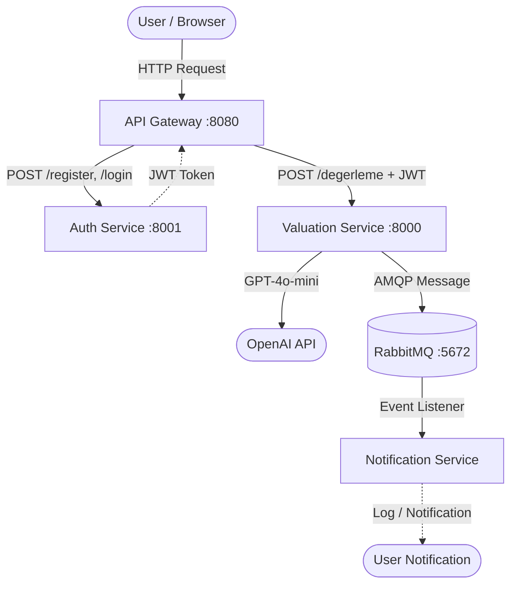

# Vehicle Valuation System — Microservice Architecture (HW3)

## Team Members

| Name | Student ID |
|---|---|
| Kayra Çolak | B2180.060068 |
| Mustafa Yalçın Canbay | B2180.060055 |
| Gökberk Dökmen | B2180.060041 |
| Umut Sınır | B2180.060013 |

---

## Overview

A distributed vehicle valuation system built with a microservice architecture. Services communicate both **synchronously (REST/HTTP)** and **asynchronously (RabbitMQ)**. Users can register, log in, and receive an AI-powered price estimate for any vehicle.

---

## Architecture

```
User / Browser
      │
      ▼
[API Gateway :8080]  ──  Single entry point, JWT validation
      │              │
      │   REST (HTTP)│
      ▼              ▼
[Auth Service]   [Valuation Service]
    :8001              :8000
                          │
                          │  Async (RabbitMQ AMQP)
                          ▼
                  [Notification Service]
                    (Queue Listener)
```


```mermaid
graph TD
    Client([User / Browser]) -->|HTTP Request| Gateway[API Gateway :8080]

    Gateway -->|POST /register, /login| Auth[Auth Service :8001]
    Auth -.->|JWT Token| Gateway

    Gateway -->|POST /degerleme + JWT| Valuation[Valuation Service :8000]
    Valuation -->|GPT-4o-mini| OpenAI([OpenAI API])

    Valuation -->|AMQP Message| RabbitMQ[(RabbitMQ :5672)]
    RabbitMQ -->|Event Listener| Notification[Notification Service]
    Notification -.->|Log / Notification| UserLog([User Notification])
```

---

## Services

| Service | Port | Responsibility |
|---|---|---|
| API Gateway | 8080 | Single entry point, JWT validation, request routing |
| Auth Service | 8001 | User registration, login, JWT token generation |
| Valuation Service | 8000 | Vehicle price calculation + OpenAI GPT-4o-mini analysis |
| Notification Service | — | RabbitMQ queue listener, notification simulation |
| RabbitMQ | 5672 / 15672 | Async message broker |

---

## Technology Stack

| Category | Technology |
|---|---|
| API Framework | FastAPI + Python 3.11 |
| Authentication | JWT (HS256, 30 min expiry) |
| Async Messaging | RabbitMQ + pika |
| AI Analysis | OpenAI GPT-4o-mini |
| Containerization | Docker + Docker Compose |
| Container Orchestration | Kubernetes |
| CI/CD | GitHub Actions |
| Testing | pytest |

---

## CI/CD Pipeline

The project uses a 3-stage **GitHub Actions** pipeline defined in `.github/workflows/ci-cd.yml`:

```
Push / PR to main
       │
       ▼
  ┌─────────┐     ┌─────────┐     ┌─────────┐
  │  TEST   │────▶│  BUILD  │────▶│ DEPLOY  │
  │ pytest  │     │ docker  │     │ kubectl │
  │ 21 tests│     │ compose │     │  apply  │
  └─────────┘     └─────────┘     └─────────┘
```

- **Test job** — runs on every push and pull request
- **Build job** — builds all Docker images after tests pass
- **Deploy job** — runs only on pushes to `main`

---

## Automated Tests

21 tests across 3 test files covering all services:

```
tests/
├── test_auth_service.py      # Registration, login, password hashing
├── test_valuation_service.py # Price algorithm, damage discount, AI fallback
└── test_api_gateway.py       # JWT validation, expired tokens, request proxying
```

Run tests locally:

```bash
pip install -r requirements-test.txt
pytest tests/ -v
```

---

## Environment Configuration

Copy the example file and fill in your API key:

```bash
cp .env.example .env
```

Edit `.env`:

```
OPENAI_API_KEY=sk-proj-your-real-key-here
```

For GitHub Actions, add the secret under:
**Repo → Settings → Secrets and variables → Actions → New repository secret**
- Name: `OPENAI_API_KEY`
- Value: your OpenAI API key

---

## Running with Docker Compose

**Prerequisites:** [Docker Desktop](https://www.docker.com/products/docker-desktop/)

```bash
# Start all services
docker compose up --build

# Run in background
docker compose up --build -d

# Stop
docker compose down
```

Once running, open in your browser:

| URL | Description |
|---|---|
| http://localhost:8000 | Vehicle valuation web form |
| http://localhost:8001 | Login / Register page |
| http://localhost:15672 | RabbitMQ management panel (guest / guest) |

---

## Running with Kubernetes

**Prerequisites:** [minikube](https://minikube.sigs.k8s.io/) or any Kubernetes cluster

```bash
# 1. Build images inside minikube's Docker daemon
eval $(minikube docker-env)
docker compose build

# 2. Set your OpenAI API key in k8s/secret.yaml

# 3. Deploy everything
bash deploy.sh

# 4. Access the API Gateway
kubectl port-forward svc/api-gateway 8080:8080 -n araba-degerleme
```

Kubernetes manifests are located in the `k8s/` directory:

```
k8s/
├── namespace.yaml
├── configmap.yaml
├── secret.yaml
├── rabbitmq.yaml
├── auth-service.yaml
├── valuation-service.yaml
├── notification-service.yaml
└── api-gateway.yaml
```

---

## API Usage

### Step 1 — Register

```bash
curl -X POST http://localhost:8080/register \
  -H "Content-Type: application/json" \
  -d '{"username": "testuser", "password": "pass123"}'
```

### Step 2 — Login (get token)

```bash
curl -X POST http://localhost:8080/login \
  -H "Content-Type: application/json" \
  -d '{"username": "testuser", "password": "pass123"}'
# Response: {"access_token": "eyJ...", "token_type": "bearer"}
```

### Step 3 — Valuate a Vehicle (with token)

```bash
curl -X POST http://localhost:8080/api/v1/degerleme \
  -H "Content-Type: application/json" \
  -H "Authorization: Bearer <YOUR_TOKEN>" \
  -d '{"marka": "Toyota", "model_yili": 2020, "kilometre": 50000, "hasar_kaydi": false}'
```

**Example response:**

```json
{
  "arac_bilgisi": { "marka": "Toyota", "model_yili": 2020, "kilometre": 50000, "hasar_kaydi": false },
  "hesaplanan_fiyat_tl": 487500.0,
  "ai_analizi": {
    "piyasa_yorumu": "This price is reasonable given current market conditions.",
    "ozet": "Low mileage is a strong point; the model year is slightly aging."
  }
}
```

---

## Price Calculation Algorithm

```
Base price:       800,000 TL
- Age penalty:    age × 25,000 TL
- Mileage penalty: km × 1.2 TL
- Damage record:  × 0.80  (20% discount)
- Random variance: ±15,000 TL
- Minimum floor:  50,000 TL
```

---

## Project Structure

```
araba-degerleme-odevi/
├── api-gateway/              # Entry point, JWT auth, routing
├── auth-service/             # User management, token generation
├── valuation-service/        # Price engine + OpenAI integration
│   ├── models.py
│   └── services.py
├── notification-service/     # Async RabbitMQ consumer
├── tests/                    # 21 automated tests
├── k8s/                      # Kubernetes manifests
├── .github/workflows/        # GitHub Actions CI/CD
├── docker-compose.yml
├── deploy.sh                 # Kubernetes deploy script
├── requirements-test.txt
└── .env.example
```
