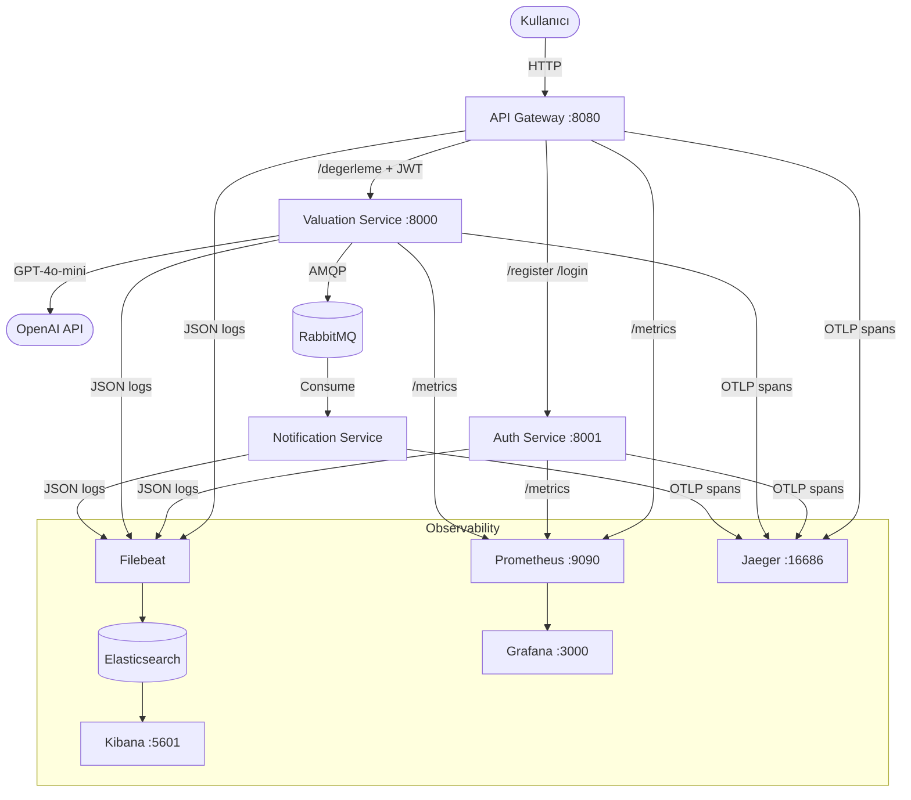

# Araç Değerleme Sistemi — Mikroservis Mimarisi

## Ekip

| İsim | Öğrenci No |
|---|---|
| Kayra Çolak | B2180.060068 |
| Mustafa Yalçın Canbay | B2180.060055 |
| Gökberk Dökmen | B2180.060041 |
| Umut Sınır | B2180.060013 |

---

## Projeye Genel Bakış

Mikroservis mimarisiyle geliştirilmiş bir araç değerleme sistemi. Kullanıcılar kayıt olup giriş yaparak herhangi bir araç için JWT korumalı endpoint üzerinden yapay zeka destekli fiyat tahmini alabilir. Servisler hem **senkron (REST/HTTP)** hem de **asenkron (RabbitMQ)** iletişim kurar.

Bu son aşamada sisteme **gözlemlenebilirlik (observability)** ve **hata toleransı (fault tolerance)** katmanı eklendi:
- Merkezi log toplama (ELK Stack)
- Metrik izleme (Prometheus + Grafana)
- Dağıtık izleme (OpenTelemetry + Jaeger)
- Health check endpoint'leri
- Circuit breaker, retry ve dead letter queue

---

## Mimari

### Uygulama Akışı

```
┌─────────────────────────────────────────────────────────────────┐
│                         KULLANICI / TARAYICI                    │
└───────────────────────────────┬─────────────────────────────────┘
                                │ HTTP
                                ▼
                ┌───────────────────────────────┐
                │    API GATEWAY  :8080          │
                │  · JWT doğrulama               │
                │  · İstek yönlendirme           │
                │  · X-Trace-ID üretimi          │
                └──────────┬────────────┬────────┘
                           │            │
              REST/HTTP     │            │  REST/HTTP
                           ▼            ▼
              ┌────────────────┐  ┌──────────────────────┐
              │  AUTH SERVICE  │  │  VALUATION SERVICE   │
              │    :8001       │  │       :8000          │
              │  · Kayıt/Giriş │  │  · Fiyat hesaplama   │
              │  · JWT üretimi │  │  · OpenAI GPT-4o-mini│
              └────────────────┘  │  · RabbitMQ yayını   │
                                  └──────────┬───────────┘
                                             │ AMQP
                                             ▼
                              ┌──────────────────────────┐
                              │       RABBITMQ           │
                              │  Queue: valuation_events │
                              │  DLQ:   valuation_events │
                              │         _dlq             │
                              └──────────┬───────────────┘
                                         │ Consume
                                         ▼
                              ┌──────────────────────────┐
                              │  NOTIFICATION SERVICE    │
                              │  · Mesaj tüketimi        │
                              │  · Bildirim simülasyonu  │
                              └──────────────────────────┘
```

### Gözlemlenebilirlik Katmanı

```
┌──────────────────────────────────────────────────────────────────────────┐
│                         MONITORING STACK                                 │
│                                                                          │
│   Tüm Servisler                                                          │
│   (stdout JSON log) ──► Filebeat ──► Elasticsearch ──► Kibana :5601     │
│                                                                          │
│   Tüm Servisler                                                          │
│   (/metrics endpoint) ──► Prometheus :9090 ──► Grafana :3000            │
│                                                                          │
│   Tüm Servisler                                                          │
│   (OTLP HTTP spans) ──► Jaeger :4318 ──► Jaeger UI :16686               │
└──────────────────────────────────────────────────────────────────────────┘
```

### Mermaid Diyagram


```mermaid
graph TD
    Client([Kullanıcı]) -->|HTTP| GW[API Gateway :8080]

    GW -->|/register /login| Auth[Auth Service :8001]
    GW -->|/degerleme + JWT| Val[Valuation Service :8000]

    Val -->|GPT-4o-mini| OAI([OpenAI API])
    Val -->|AMQP| MQ[(RabbitMQ)]
    MQ -->|Consume| Notif[Notification Service]

    subgraph Observability
        Filebeat --> ES[(Elasticsearch)]
        ES --> Kibana[Kibana :5601]
        Prom[Prometheus :9090] --> Grafana[Grafana :3000]
        Jaeger[Jaeger :16686]
    end

    GW & Auth & Val & Notif -->|JSON logs| Filebeat
    GW & Auth & Val -->|/metrics| Prom
    GW & Auth & Val & Notif -->|OTLP spans| Jaeger
```

---

## Servisler

| Servis | Port | Görev |
|---|---|---|
| API Gateway | 8080 | Tek giriş noktası, JWT doğrulama, yönlendirme |
| Auth Service | 8001 | Kullanıcı kaydı, giriş, JWT üretimi |
| Valuation Service | 8000 | Fiyat hesaplama + OpenAI analizi |
| Notification Service | — | RabbitMQ tüketici, bildirim simülasyonu |
| **Market Data Service** | **8002** | **Piyasa zekası — benzer ilanlar, şehir bazlı fiyat, talep skoru, müzakere asistanı** |
| RabbitMQ | 5672 / 15672 | Asenkron mesaj kuyruğu |
| Elasticsearch | 9200 | Log depolama |
| Kibana | 5601 | Log görselleştirme |
| Filebeat | — | Log toplayıcı (Docker → Elasticsearch) |
| Prometheus | 9090 | Metrik toplama ve depolama |
| Grafana | 3000 | Metrik dashboard |
| Jaeger | 16686 | Distributed tracing UI |

---

## Teknoloji Yığını

| Kategori | Teknoloji |
|---|---|
| API Framework | FastAPI + Python 3.11 |
| Kimlik Doğrulama | JWT (HS256, 30 dk geçerlilik) |
| Asenkron Mesajlaşma | RabbitMQ + pika |
| AI Entegrasyonu | OpenAI GPT-4o-mini |
| Konteynerizasyon | Docker + Docker Compose |
| Orkestrasyon | Kubernetes |
| CI/CD | GitHub Actions |
| Test | pytest (21 test) |
| **Piyasa Zekası** | **Market Data Service (yeni mikroservis)** |
| Merkezi Loglama | ELK Stack (Elasticsearch + Logstash + Kibana) |
| Log Toplayıcı | Filebeat |
| Structured Logging | python-json-logger |
| Metrik İzleme | Prometheus + Grafana |
| Dağıtık İzleme | OpenTelemetry + Jaeger |
| Circuit Breaker | pybreaker |
| Retry / Backoff | tenacity |

---

## Hızlı Başlangıç

### 1. Gereksinimler

- [Docker Desktop](https://www.docker.com/products/docker-desktop/) kurulu ve çalışıyor olmalı
- OpenAI API key

### 2. Ortam Değişkenlerini Ayarla

```bash
cp .env.example .env
# .env dosyasını aç ve OPENAI_API_KEY değerini gir
```

`.env` içeriği:
```
OPENAI_API_KEY=sk-proj-buraya-gercek-key-yaz
```

### 3. Sistemi Başlat

```bash
docker compose up --build
```

> **Not:** İlk çalıştırmada Elasticsearch ve Kibana image'ları indirilir (~2 GB), **10-15 dakika** sürebilir. Sonraki başlatmalar çok daha hızlıdır.

```bash
# Arka planda çalıştırmak için
docker compose up --build -d

# Durdurmak için
docker compose down

# Tüm verileri sıfırlamak için (Elasticsearch verisi dahil)
docker compose down -v
```

---

## Tüm Erişim Noktaları

### Uygulama

| URL | Açıklama |
|---|---|
| http://localhost:8080 | Ana giriş (API Gateway) |
| http://localhost:8001 | Giriş / Kayıt sayfası |
| http://localhost:8000 | Araç değerleme formu |
| http://localhost:15672 | RabbitMQ yönetim paneli (`guest` / `guest`) |

### Monitoring

| URL | Açıklama | Giriş |
|---|---|---|
| http://localhost:3000 | Grafana — metrik dashboard | `admin` / `admin` |
| http://localhost:16686 | Jaeger — distributed tracing | — |
| http://localhost:9090 | Prometheus — ham metrikler | — |
| http://localhost:5601 | Kibana — log analizi | — |
| http://localhost:9200 | Elasticsearch API | — |

### Health Check Endpoint'leri

```bash
curl http://localhost:8080/health   # Gateway + bağımlılık durumu
curl http://localhost:8000/health   # Valuation + RabbitMQ + Circuit Breaker
curl http://localhost:8001/health   # Auth service
```

Örnek yanıt (`/health` valuation-service):
```json
{
  "status": "ok",
  "service": "valuation-service",
  "dependencies": {
    "rabbitmq": "ok",
    "openai_key": "set",
    "circuit_breaker": "closed"
  }
}
```

---

## Gözlemlenebilirlik Özellikleri

### 1. Merkezi Loglama — ELK Stack

Her servis loglarını **JSON formatında** `stdout`'a yazar. Filebeat bu logları Docker socket üzerinden okuyarak Elasticsearch'e gönderir. Kibana üzerinden sorgulanır.

Her log satırında şu alanlar bulunur:

| Alan | Açıklama | Örnek |
|---|---|---|
| `service` | Hangi servis | `"valuation-service"` |
| `level` | Log seviyesi | `"INFO"`, `"WARNING"` |
| `trace_id` | Uçtan uca istek ID'si | `"a3f2-..."` |
| `message` | Log mesajı | `"Değerleme isteği alındı"` |
| `asctime` | Zaman damgası | `"2025-01-01T12:00:00"` |

**Kibana'da kullanım:**
1. http://localhost:5601 → **Discover**
2. İlk açılışta: **Create data view** → pattern: `microservices-*` → **Save**
3. Örnek filtreler:
   - `service: "valuation-service" AND level: "WARNING"` — sadece hatalar
   - `trace_id: "abc123"` — tek bir isteğin tüm servislerdeki izini bul

### 2. Metrik İzleme — Prometheus + Grafana

Her FastAPI servisi `/metrics` endpoint'i üzerinden Prometheus metriklerini yayar. Prometheus bu endpoint'leri 15 saniyede bir okur.

**Toplanan metrikler:**

| Metrik | Tür | Açıklama |
|---|---|---|
| `http_requests_total` | Counter | Servis başına toplam istek sayısı |
| `http_request_duration_seconds` | Histogram | İstek süreleri (p50, p95, p99) |
| `valuation_price_tl` | Histogram | Hesaplanan araç fiyatları |
| `openai_api_calls_total` | Counter | OpenAI çağrıları (`success`/`failure`/`circuit_open`) |
| `circuit_breaker_state` | Gauge | 0=kapalı (normal), 1=açık (hata), 2=yarı-açık |
| `rabbitmq_queue_messages_ready` | Gauge | Kuyrukta bekleyen mesaj sayısı |

**Grafana dashboard'u:**
1. http://localhost:3000 → `admin` / `admin`
2. Sol menü → **Dashboards** → **Araba Değerleme — Mikroservis Dashboard**
3. Dashboard otomatik yüklü gelir, 9 panel içerir

Dashboard panelleri:

```
┌────────────────────┬────────────────────┐
│  HTTP Request Rate │  HTTP p95 Latency  │
│  (req/s)           │  (ms)              │
├────────────────────┼────────────────────┤
│  HTTP Error Rate   │  Fiyat Dağılımı    │
│  (5xx %)           │  (p50 / p95 TL)   │
├────────────────────┬──────┬─────────────┤
│  OpenAI API Calls  │  CB  │  RabbitMQ   │
│  (success/fail)    │  Dur │  Queue Depth│
├────────────────────┴──────┼─────────────┤
│  24h Değerleme Sayısı     │  DLQ Mesaj  │
└───────────────────────────┴─────────────┘
```

### 3. Dağıtık İzleme — OpenTelemetry + Jaeger

Her HTTP isteği için API Gateway'den başlayıp tüm servislere yayılan bir **trace** oluşturulur. Trace; hangi servisin ne kadar sürdüğünü, darboğazların nerede olduğunu gösterir.

```
Örnek trace (tek bir /degerleme isteği):

[API Gateway]  ████████████████████████████████  180ms
  [Valuation]    ████████████████████████████    170ms
    [fiyat_hesapla]  ██                           2ms
    [OpenAI API]     ████████████████████        155ms  ← darboğaz
    [RabbitMQ pub]              ██               3ms
```

**Jaeger'da kullanım:**
1. http://localhost:16686
2. **Service** → `api-gateway` seç → **Find Traces**
3. Bir trace'e tıkla → şelale görünümünde her span'ı incele

### 4. Health Check'ler

| Servis | Endpoint | Kontrol Ettiği |
|---|---|---|
| API Gateway | `GET /health` | auth-service + valuation-service bağlantısı |
| Valuation | `GET /health` | RabbitMQ bağlantısı + OpenAI key + CB durumu |
| Auth | `GET /health` | Servis durumu + kayıtlı kullanıcı sayısı |

Docker Compose `healthcheck` direktifleri bu endpoint'leri kullanır. Kubernetes manifest'lerinde `livenessProbe` ve `readinessProbe` olarak da tanımlanmıştır.

### 5. Hata Toleransı

#### Circuit Breaker (OpenAI için)

```
Normal durum:
  İstek → [Kapalı] → OpenAI API → Yanıt

3 ardışık hata sonrası:
  İstek → [AÇIK] → Direkt fallback döner (30 sn boyunca OpenAI'a istek GITMEZ)

30 saniye sonra:
  İstek → [Yarı-Açık] → Bir deneme yapılır → Başarılıysa [Kapalı]'ya döner
```

- `fail_max = 3` — 3 ardışık hata devreyi açar
- `reset_timeout = 30s` — 30 saniye sonra tekrar dener
- Durum Grafana'da `circuit_breaker_state` metriği ile izlenir

#### Retry with Exponential Backoff (RabbitMQ publish için)

```
1. deneme → hata → 1 sn bekle
2. deneme → hata → 2 sn bekle
3. deneme → hata → 4 sn bekle → publish_event hata olarak işaretlenir, servis devam eder
```

#### Dead Letter Queue (DLQ)

```
valuation_events (ana kuyruk)
    │
    │ Eğer Notification Service mesajı işleyemezse
    ▼
valuation_events_dlq (ölü mektup kuyruğu)
```

- Notification Service mesajı işleyemezse `basic_nack(requeue=False)` ile DLQ'ya gönderir
- RabbitMQ yönetim panelinde (http://localhost:15672) her iki kuyruk da görünür
- Grafana dashboard'unda DLQ derinliği izlenir; biriken mesaj kırmızı alarm verir

---

## Piyasa Zekası — Market Data Service

Bu ödevin ana yeniliği: sahibinden.com ve arabam.com'dan ilham alınarak tasarlanmış bağımsız bir piyasa analiz mikroservisi.

### Mimari Akış

```
Kullanıcı araç girer
        │
        ▼
[Valuation Service] ── fiyat hesapla ──► [Market Data Service :8002]
        │                                         │
        │                              ┌──────────┴──────────────┐
        │                              │  market_engine.py       │
        │                              │  · Benzer ilanlar üret  │
        │                              │  · Şehir çarpanı uygula │
        │                              │  · Talep skoru hesapla  │
        │                              │  · Anomali tespiti      │
        │                              │  · Müzakere asistanı    │
        │                              └──────────┬──────────────┘
        │◄──── piyasa_raporu ──────────────────────┘
        │
        ▼
Zengin API yanıtı
```

### Değerleme Yanıtındaki Yeni Alanlar

```json
{
  "hesaplanan_fiyat_tl": 487500,
  "ai_analizi": { ... },

  "piyasa_raporu": {
    "benzer_ilanlar": [
      { "marka": "Toyota", "model_yili": 2020, "kilometre": 48200,
        "fiyat_tl": 465000, "il": "Ankara", "ilan_tarihi": "12 gün önce" }
    ],
    "istatistikler": {
      "ortalama_fiyat": 492000,
      "en_dusuk": 451000,
      "en_yuksek": 528000,
      "fiyat_konumu": "Piyasanın %0.9 altında",
      "konum_etiketi": "REKABETCİ"
    },
    "talep": {
      "skor": 8.4,
      "ortalama_satis_suresi": "10-18 gün",
      "populerite": "Yüksek talep"
    },
    "il_karsilastirmasi": {
      "Istanbul": 522375, "Ankara": 487500,
      "Izmir": 502125, "Bursa": 478575, "Antalya": 498645
    },
    "deger_tahmini": {
      "bugun": 488000, "1_yil": 461000, "2_yil": 437000,
      "3_yil": 414000, "5_yil": 372000,
      "yorum": "5 yılda yaklaşık 116.000 TL değer kaybı öngörülüyor."
    },
    "dogrulama": {
      "yillik_km": 12500,
      "km_yas_orani": "normal",
      "uyarilar": [],
      "risk_skoru": 0.0,
      "risk_seviyesi": "düşük"
    },
    "musteri_tavsiyeleri": {
      "liste_fiyati_onerisi": 507000,
      "hedef_satis_fiyati": 488000,
      "muzakere_marji": "Yaklaşık %4 indirim payı bırakın",
      "en_iyi_sehir": "Istanbul (+34.875 TL potansiyel kazanım)",
      "ilkbahar_tavsiyesi": "İlkbahar (Mart-Mayıs) satışlar için en yoğun dönem."
    }
  }
}
```

### Market Data Service Endpoint'leri

| Endpoint | Açıklama |
|---|---|
| `POST /api/v1/piyasa-raporu` | Araç için tam piyasa raporu |
| `GET /api/v1/iller` | Tüm şehirler ve fiyat çarpanları |
| `GET /api/v1/markalar` | Marka talep skorları |
| `GET /api/v1/sehir-kiyasi?fiyat=X` | Bir fiyatı tüm şehirlerde hesapla |

### Şehir Fiyat Çarpanları (Örnek)

| Şehir | Çarpan | Ankara'ya Göre |
|---|---|---|
| İstanbul | 1.072 | +%7.2 |
| Gebze | 1.041 | +%4.1 |
| Kocaeli | 1.008 | +%0.8 |
| **Ankara** | **1.000** | **Baz** |
| Bursa | 0.982 | -%1.8 |
| Erzurum | 0.912 | -%8.8 |

### Anomali Tespiti Mantığı

```
Yıllık km = toplam_km / araç_yaşı

Eğer > 35.000 km/yıl  → "Sayaç müdahalesi riski"  (risk: yüksek)
Eğer < 3.000 km/yıl   → "Sayaç geriye alınmış olabilir" (risk: orta)
Fiyat > piyasa × 1.25 → "Aşırı fiyatlı, satış güçleşir"
Fiyat < piyasa × 0.80 → "Şüpheli ucuzluk, dikkat"
```

---

## CI/CD Pipeline

```
GitHub'a push / PR açılınca
           │
           ▼
    ┌─────────────┐     ┌─────────────┐     ┌─────────────┐
    │    TEST     │────▶│    BUILD    │────▶│   DEPLOY    │
    │  pytest     │     │   docker    │     │   (main     │
    │  21 tests   │     │compose build│     │  branch'te) │
    └─────────────┘     └─────────────┘     └─────────────┘
```

- **Test** — her push ve PR'da çalışır
- **Build** — testler geçince Docker image'ları build eder
- **Deploy** — yalnızca `main` branch'e push'ta çalışır

---

## Otomatik Testler

21 test, 3 dosyada tüm servisleri kapsar:

```
tests/
├── test_auth_service.py       # Kayıt, giriş, şifre hashleme (7 test)
├── test_valuation_service.py  # Fiyat algoritması, hasar indirimi, AI fallback (7 test)
└── test_api_gateway.py        # JWT doğrulama, süresi dolmuş token, proxy (7 test)
```

```bash
pip install -r requirements-test.txt
pytest tests/ -v
```

---

## API Kullanımı

### Adım 1 — Kayıt Ol

```bash
curl -X POST http://localhost:8080/register \
  -H "Content-Type: application/json" \
  -d '{"username": "testuser", "password": "pass123"}'
```

### Adım 2 — Giriş Yap (JWT token al)

```bash
curl -X POST http://localhost:8080/login \
  -H "Content-Type: application/json" \
  -d '{"username": "testuser", "password": "pass123"}'
# Yanıt: {"access_token": "eyJ...", "token_type": "bearer"}
```

### Adım 3 — Araç Değerle (token ile)

```bash
curl -X POST http://localhost:8080/api/v1/degerleme \
  -H "Content-Type: application/json" \
  -H "Authorization: Bearer <TOKEN>" \
  -d '{"marka": "Toyota", "model_yili": 2020, "kilometre": 50000, "hasar_kaydi": false}'
```

**Örnek yanıt:**
```json
{
  "arac_bilgisi": {
    "marka": "Toyota",
    "model_yili": 2020,
    "kilometre": 50000,
    "hasar_kaydi": false
  },
  "hesaplanan_fiyat_tl": 487500.0,
  "ai_analizi": {
    "piyasa_yorumu": "Fiyat piyasa koşullarına göre makul.",
    "ozet": "Düşük kilometre güçlü yön, model yaşı zayıf yön."
  }
}
```

---

## Fiyat Hesaplama Algoritması

```
Taban fiyat:          800.000 TL
- Yaş cezası:         (güncel_yıl - model_yılı) × 25.000 TL
- Kilometre cezası:   kilometre × 1,2 TL
- Hasar indirimi:     × 0,80  (hasar kaydı varsa %20 indirim)
- Rastgele varyans:   ±15.000 TL
- Minimum tavan:      50.000 TL (altına düşemez)
```

---

## Proje Yapısı

```
araba-degerleme-odevi/
│
├── api-gateway/               # Giriş noktası — JWT doğrulama, yönlendirme
│   ├── main.py                  OTel + Prometheus + health check + trace_id middleware
│   ├── requirements.txt
│   └── Dockerfile
│
├── auth-service/              # Kullanıcı yönetimi — kayıt, giriş, JWT
│   ├── main.py                  OTel + Prometheus + health check
│   ├── requirements.txt
│   └── Dockerfile
│
├── valuation-service/         # Fiyat motoru — AI + RabbitMQ
│   ├── main.py                  Circuit breaker + retry + DLQ + custom metrics
│   ├── models.py                Pydantic: AracOzellikleri
│   ├── services.py              fiyat_hesapla() algoritması
│   ├── requirements.txt
│   └── Dockerfile
│
├── notification-service/      # Asenkron tüketici — RabbitMQ consumer
│   ├── main.py                  OTel context propagation + DLQ nack + retry
│   ├── requirements.txt
│   └── Dockerfile
│
├── monitoring/                # Tüm izleme araçlarının konfigürasyonu
│   ├── prometheus/
│   │   └── prometheus.yml         Scrape konfigürasyonu (tüm servisler + RabbitMQ)
│   ├── grafana/
│   │   ├── provisioning/
│   │   │   ├── datasources/
│   │   │   │   └── prometheus.yml  Prometheus veri kaynağı (otomatik)
│   │   │   └── dashboards/
│   │   │       └── dashboard.yml   Dashboard provider (otomatik)
│   │   └── dashboards/
│   │       └── microservices.json  9 panelli hazır dashboard
│   ├── filebeat/
│   │   └── filebeat.yml           Docker log toplama → Elasticsearch
│   └── rabbitmq/
│       └── enabled_plugins        rabbitmq_prometheus plugin
│
├── tests/                     # 21 otomatik test
├── k8s/                       # Kubernetes manifest'leri
├── .github/workflows/         # GitHub Actions CI/CD
├── docker-compose.yml         # Tüm stack (uygulama + monitoring)
├── deploy.sh                  # Kubernetes deploy script
├── requirements-test.txt
└── .env.example
```

---

## Kubernetes ile Çalıştırma

```bash
# 1. minikube Docker ortamına geç
eval $(minikube docker-env)
docker compose build

# 2. k8s/secret.yaml içinde OPENAI_API_KEY'i ayarla

# 3. Her şeyi deploy et
bash deploy.sh

# 4. API Gateway'e eriş
kubectl port-forward svc/api-gateway 8080:8080 -n araba-degerleme
```

> **Not:** Kubernetes deployment'ı yalnızca uygulama servislerini içerir. Monitoring stack (ELK, Prometheus, Grafana, Jaeger) Docker Compose ortamına özeldir.
